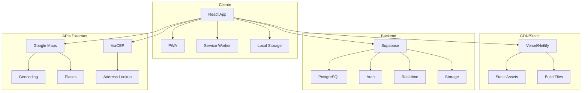
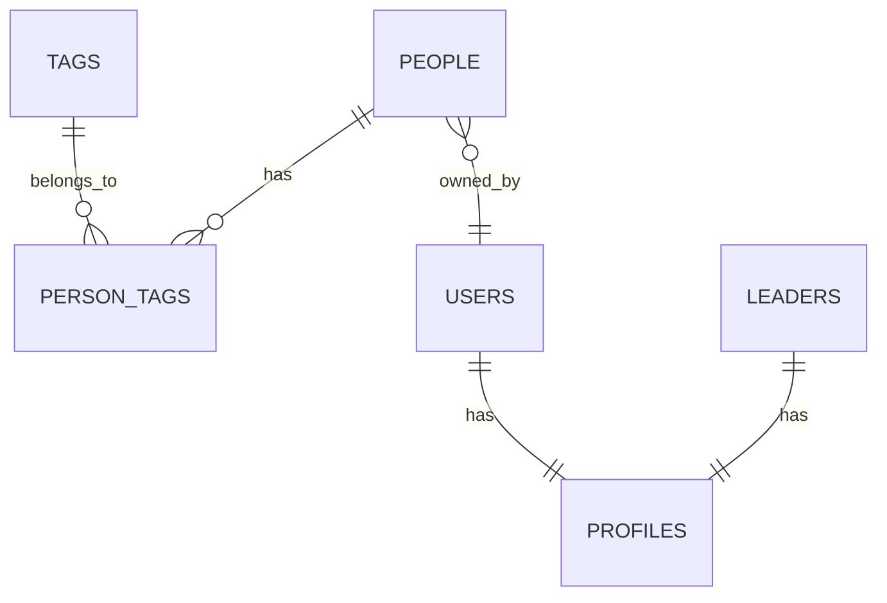
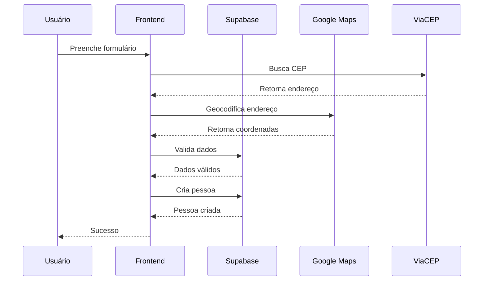
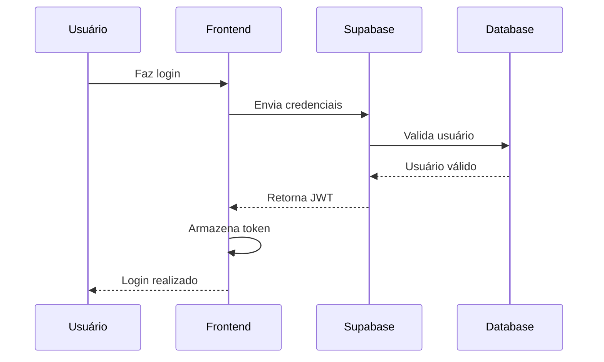

# 🏗️ Arquitetura do Sistema

Este documento descreve a arquitetura e design do Sistema de Gestão Política.

## 📋 Índice

- [🎯 Visão Geral](#-visão-geral)
- [🏛️ Arquitetura Geral](#️-arquitetura-geral)
- [📱 Frontend](#-frontend)
- [🗄️ Backend](#️-backend)
- [🔐 Segurança](#-segurança)
- [📊 Dados](#-dados)
- [🔄 Fluxos](#-fluxos)
- [⚡ Performance](#-performance)
- [🧪 Testes](#-testes)
- [🚀 Deploy](#-deploy)

## 🎯 Visão Geral

O Sistema de Gestão Política é uma **Single Page Application (SPA)** moderna construída com React e TypeScript, utilizando Supabase como Backend-as-a-Service.

### Princípios Arquiteturais
- **Separação de Responsabilidades**: Frontend, Backend e Dados bem definidos
- **Escalabilidade**: Arquitetura preparada para crescimento
- **Manutenibilidade**: Código limpo e bem documentado
- **Segurança**: Row Level Security e autenticação robusta
- **Performance**: Otimizações para carregamento rápido

## 🏛️ Arquitetura Geral



### Componentes Principais
1. **Frontend React**: Interface do usuário
2. **Supabase**: Backend e banco de dados
3. **APIs Externas**: Google Maps, ViaCEP
4. **CDN**: Hospedagem estática
5. **PWA**: Funcionalidades offline

## 📱 Frontend

### Estrutura de Pastas
```
src/
├── components/          # Componentes reutilizáveis
│   ├── ui/             # Componentes básicos (Button, Input)
│   ├── forms/          # Formulários específicos
│   ├── modals/         # Modais e dialogs
│   └── layout/         # Layout components (Header, Sidebar)
├── pages/              # Páginas da aplicação
├── hooks/              # Custom React hooks
├── services/           # Serviços e integrações
├── types/              # Definições TypeScript
├── lib/                # Utilitários e helpers
├── contexts/           # React contexts
├── test/               # Testes
└── styles/             # Estilos globais
```

### Padrões de Design

#### Componentes
```typescript
// Padrão de componente funcional com TypeScript
interface ComponentProps {
  title: string;
  onAction: () => void;
  children?: React.ReactNode;
}

const Component: React.FC<ComponentProps> = ({ 
  title, 
  onAction, 
  children 
}) => {
  return (
    <div>
      <h2>{title}</h2>
      <button onClick={onAction}>Action</button>
      {children}
    </div>
  );
};

export default memo(Component);
```

#### Hooks Customizados
```typescript
// Padrão de hook customizado
export const useCustomHook = (param: string) => {
  const [state, setState] = useState<StateType>(initialState);
  
  useEffect(() => {
    // Lógica do hook
  }, [param]);
  
  return { state, setState };
};
```

#### Serviços
```typescript
// Padrão de serviço
export const serviceName = {
  async getData(): Promise<DataType[]> {
    const { data, error } = await supabase
      .from('table')
      .select('*');
    
    if (error) throw error;
    return data;
  },
  
  async createData(item: CreateType): Promise<DataType> {
    const { data, error } = await supabase
      .from('table')
      .insert(item)
      .single();
    
    if (error) throw error;
    return data;
  }
};
```

### Gerenciamento de Estado

#### Context API
```typescript
// Context para estado global
interface AppContextType {
  user: User | null;
  theme: 'light' | 'dark';
  setTheme: (theme: 'light' | 'dark') => void;
}

const AppContext = createContext<AppContextType | undefined>(undefined);

export const useApp = () => {
  const context = useContext(AppContext);
  if (!context) {
    throw new Error('useApp must be used within AppProvider');
  }
  return context;
};
```

#### Estado Local
```typescript
// useState para estado local simples
const [loading, setLoading] = useState(false);

// useReducer para estado complexo
const [state, dispatch] = useReducer(reducer, initialState);
```

### Roteamento
```typescript
// React Router com lazy loading
const Dashboard = lazy(() => import('@/pages/Dashboard'));
const Pessoas = lazy(() => import('@/pages/Pessoas'));

<Routes>
  <Route path="/dashboard" element={
    <Suspense fallback={<LoadingSpinner />}>
      <Dashboard />
    </Suspense>
  } />
</Routes>
```

## 🗄️ Backend

### Supabase Architecture

#### Database Schema
```sql
-- Tabela principal de pessoas
CREATE TABLE people (
  id UUID PRIMARY KEY DEFAULT gen_random_uuid(),
  full_name TEXT NOT NULL,
  whatsapp TEXT UNIQUE NOT NULL,
  email TEXT,
  birth_date DATE,
  gender TEXT CHECK (gender IN ('M', 'F', 'O')),
  treatment TEXT,
  cep TEXT,
  city TEXT,
  state TEXT,
  neighborhood TEXT,
  street TEXT,
  number TEXT,
  complement TEXT,
  latitude DECIMAL(10, 8),
  longitude DECIMAL(11, 8),
  owner UUID REFERENCES auth.users(id),
  created_at TIMESTAMP WITH TIME ZONE DEFAULT NOW(),
  updated_at TIMESTAMP WITH TIME ZONE DEFAULT NOW()
);

-- Tabela de tags
CREATE TABLE tags (
  id UUID PRIMARY KEY DEFAULT gen_random_uuid(),
  name TEXT UNIQUE NOT NULL,
  color TEXT NOT NULL,
  description TEXT,
  created_at TIMESTAMP WITH TIME ZONE DEFAULT NOW(),
  updated_at TIMESTAMP WITH TIME ZONE DEFAULT NOW()
);

-- Relacionamento many-to-many
CREATE TABLE person_tags (
  person_id UUID REFERENCES people(id) ON DELETE CASCADE,
  tag_id UUID REFERENCES tags(id) ON DELETE CASCADE,
  PRIMARY KEY (person_id, tag_id)
);
```

#### Row Level Security (RLS)
```sql
-- Policy para pessoas
CREATE POLICY "Users can view own people" ON people
FOR SELECT USING (auth.uid() = owner);

CREATE POLICY "Users can insert own people" ON people
FOR INSERT WITH CHECK (auth.uid() = owner);

CREATE POLICY "Users can update own people" ON people
FOR UPDATE USING (auth.uid() = owner);

CREATE POLICY "Users can delete own people" ON people
FOR DELETE USING (auth.uid() = owner);
```

#### Functions e Triggers
```sql
-- Função para atualizar updated_at
CREATE OR REPLACE FUNCTION update_updated_at_column()
RETURNS TRIGGER AS $$
BEGIN
  NEW.updated_at = NOW();
  RETURN NEW;
END;
$$ language 'plpgsql';

-- Trigger para people
CREATE TRIGGER update_people_updated_at
  BEFORE UPDATE ON people
  FOR EACH ROW
  EXECUTE FUNCTION update_updated_at_column();
```

### API Design

#### RESTful Endpoints
```typescript
// Padrão de endpoints
GET    /api/people          // Listar pessoas
POST   /api/people          // Criar pessoa
GET    /api/people/:id      // Buscar pessoa
PUT    /api/people/:id      // Atualizar pessoa
DELETE /api/people/:id      // Deletar pessoa
```

#### Real-time Subscriptions
```typescript
// Subscription para mudanças em tempo real
const subscription = supabase
  .channel('people-changes')
  .on('postgres_changes', {
    event: '*',
    schema: 'public',
    table: 'people'
  }, (payload) => {
    console.log('Change received!', payload);
  })
  .subscribe();
```

## 🔐 Segurança

### Autenticação
```typescript
// Fluxo de autenticação
1. Usuário faz login
2. Supabase retorna JWT token
3. Token é armazenado em httpOnly cookie
4. Requests incluem token no header
5. Supabase valida token
6. RLS policies aplicadas
```

### Autorização
```typescript
// Sistema de roles
enum UserRole {
  ADMIN = 'ADMIN',
  LEADER = 'LEADER'
}

// Verificação de permissão
const isAdmin = user?.role === UserRole.ADMIN;
const canEdit = isAdmin || user?.id === item.owner;
```

### Row Level Security
```sql
-- Policies baseadas em usuário
CREATE POLICY "Admin can do everything" ON people
FOR ALL USING (
  EXISTS (
    SELECT 1 FROM auth.users 
    WHERE id = auth.uid() 
    AND raw_user_meta_data->>'role' = 'ADMIN'
  )
);
```

### Validação de Dados
```typescript
// Zod schemas para validação
const PersonSchema = z.object({
  full_name: z.string().min(2, 'Nome deve ter pelo menos 2 caracteres'),
  whatsapp: z.string().regex(/^\d{10,11}$/, 'WhatsApp inválido'),
  email: z.string().email('Email inválido').optional(),
  gender: z.enum(['M', 'F', 'O']).optional()
});
```

## 📊 Dados

### Modelo de Dados

#### Entidades Principais
```typescript
interface Person {
  id: string;
  full_name: string;
  whatsapp: string;
  email?: string;
  birth_date?: string;
  gender?: 'M' | 'F' | 'O';
  treatment?: string;
  address: Address;
  location: Location;
  owner: string;
  tags: Tag[];
  created_at: string;
  updated_at: string;
}

interface Tag {
  id: string;
  name: string;
  color: string;
  description?: string;
}

interface Leader {
  id: string;
  email: string;
  role: 'LEADER' | 'ADMIN';
  full_name?: string;
  profile: Profile;
}
```

#### Relacionamentos


### Migração de Dados
```sql
-- Script de migração
BEGIN;

-- Adicionar nova coluna
ALTER TABLE people ADD COLUMN notes TEXT;

-- Atualizar dados existentes
UPDATE people SET notes = '' WHERE notes IS NULL;

-- Criar índice
CREATE INDEX idx_people_notes ON people USING gin(to_tsvector('portuguese', notes));

COMMIT;
```

## 🔄 Fluxos

### Fluxo de Cadastro de Pessoa


### Fluxo de Autenticação


## ⚡ Performance

### Otimizações Frontend
```typescript
// Lazy loading de componentes
const Dashboard = lazy(() => import('@/pages/Dashboard'));

// Memoização de componentes
const ExpensiveComponent = memo(({ data }) => {
  return <div>{data}</div>;
});

// Memoização de callbacks
const handleClick = useCallback(() => {
  // Lógica
}, [dependency]);

// Memoização de valores computados
const expensiveValue = useMemo(() => {
  return computeExpensiveValue(data);
}, [data]);
```

### Otimizações Backend
```sql
-- Índices para performance
CREATE INDEX idx_people_owner ON people(owner);
CREATE INDEX idx_people_city ON people(city);
CREATE INDEX idx_people_whatsapp ON people(whatsapp);

-- Índice composto
CREATE INDEX idx_people_owner_city ON people(owner, city);

-- Índice para busca full-text
CREATE INDEX idx_people_full_name_fts ON people 
USING gin(to_tsvector('portuguese', full_name));
```

### Caching
```typescript
// Cache de dados com React Query
const { data, isLoading } = useQuery({
  queryKey: ['people', filters],
  queryFn: () => fetchPeople(filters),
  staleTime: 5 * 60 * 1000, // 5 minutos
  cacheTime: 10 * 60 * 1000, // 10 minutos
});
```

## 🧪 Testes

### Estratégia de Testes
```typescript
// Testes unitários
describe('PersonService', () => {
  it('should create person', async () => {
    const person = createMockPerson();
    const result = await createPerson(person);
    expect(result.data).toBeDefined();
  });
});

// Testes de integração
describe('PersonForm Integration', () => {
  it('should create person with form', async () => {
    render(<PersonForm />);
    // Preencher formulário
    // Submeter
    // Verificar resultado
  });
});

// Testes E2E
describe('Person Management E2E', () => {
  it('should complete person workflow', async () => {
    // Login
    // Navegar para pessoas
    // Criar pessoa
    // Verificar na lista
    // Editar pessoa
    // Deletar pessoa
  });
});
```

### Cobertura de Testes
- **Unitários**: 80%+ para serviços e utilitários
- **Integração**: 70%+ para componentes
- **E2E**: Fluxos críticos cobertos

## 🚀 Deploy

### Ambiente de Desenvolvimento
```bash
# Local
npm run dev

# Docker
docker-compose up -d
```

### Ambiente de Produção
```bash
# Build
npm run build

# Deploy para Vercel
vercel --prod

# Deploy para Netlify
netlify deploy --prod
```

### CI/CD Pipeline
```yaml
# .github/workflows/ci.yml
name: CI/CD
on: [push, pull_request]
jobs:
  test:
    runs-on: ubuntu-latest
    steps:
      - uses: actions/checkout@v3
      - uses: actions/setup-node@v3
      - run: npm install
      - run: npm run test
      - run: npm run build
```

### Monitoramento
```typescript
// Sentry para error tracking
import * as Sentry from '@sentry/react';

Sentry.init({
  dsn: process.env.VITE_SENTRY_DSN,
  environment: process.env.NODE_ENV,
});

// Performance monitoring
const performanceObserver = new PerformanceObserver((list) => {
  list.getEntries().forEach((entry) => {
    if (entry.entryType === 'navigation') {
      console.log('Page load time:', entry.loadEventEnd - entry.loadEventStart);
    }
  });
});
```

---

🏗️ **Arquitetura Robusta!**

Esta arquitetura garante:
- **Escalabilidade**: Preparada para crescimento
- **Manutenibilidade**: Código limpo e organizado
- **Segurança**: Múltiplas camadas de proteção
- **Performance**: Otimizada para velocidade
- **Confiabilidade**: Testes abrangentes
